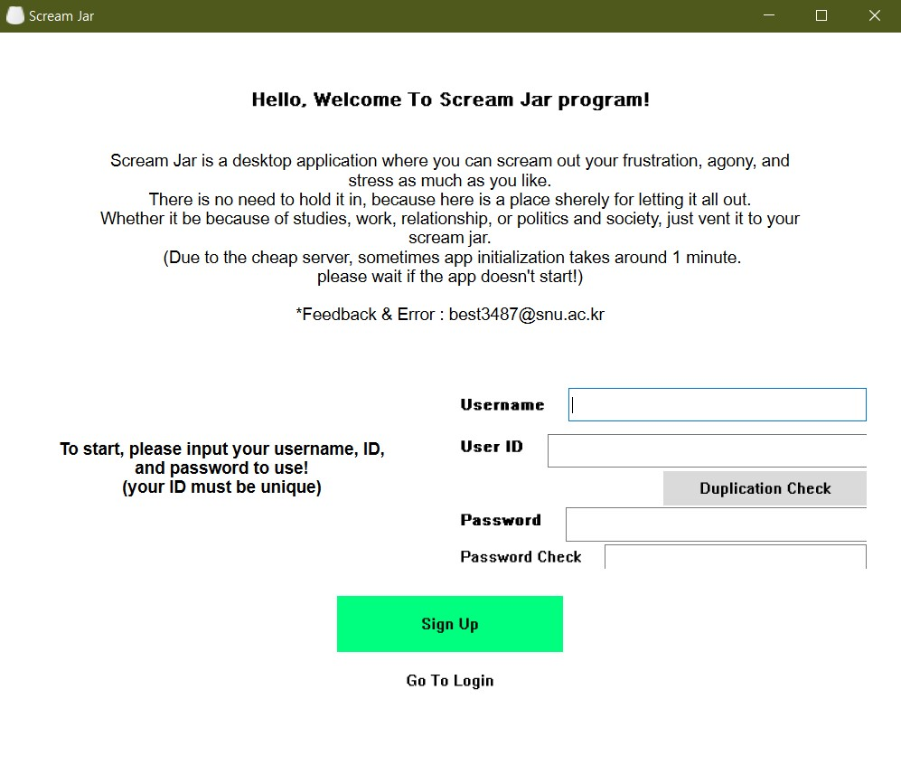
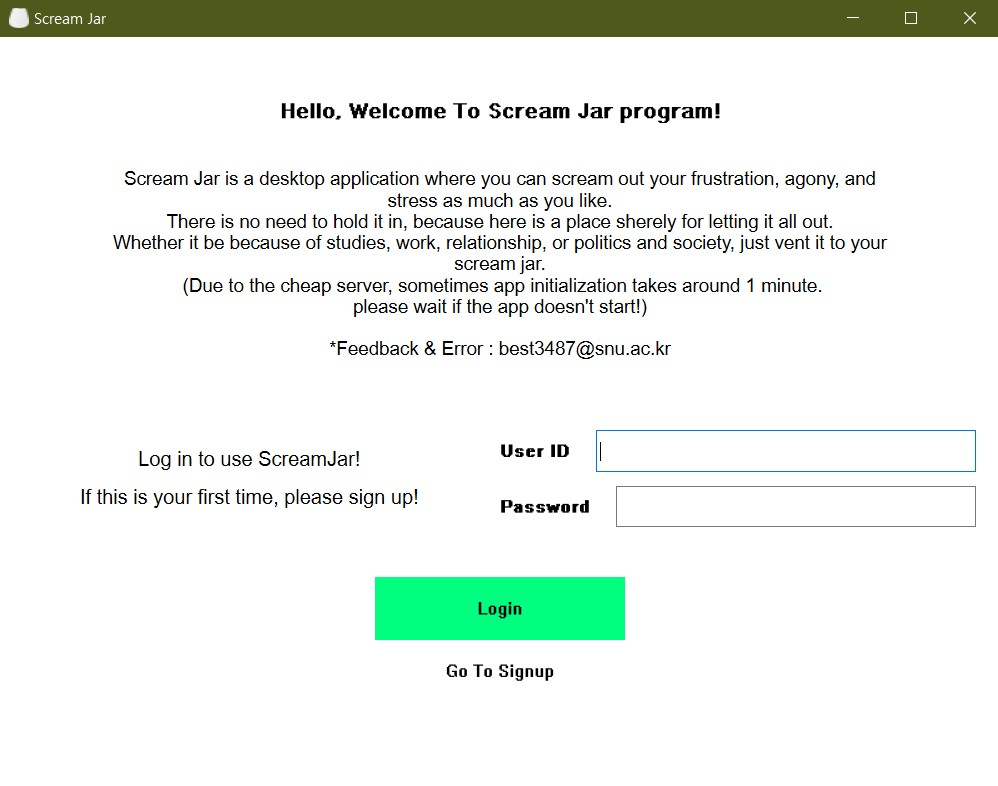
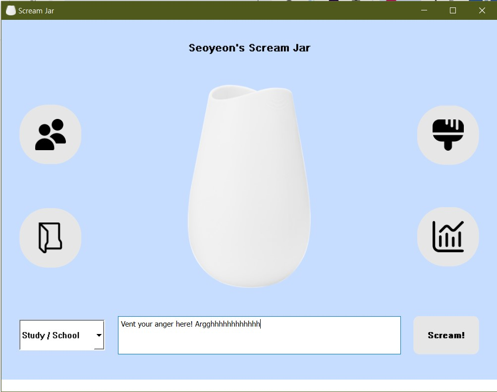
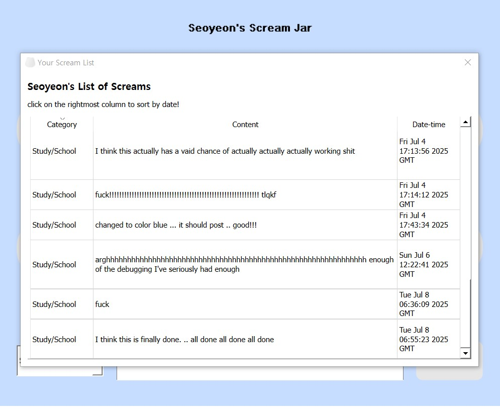
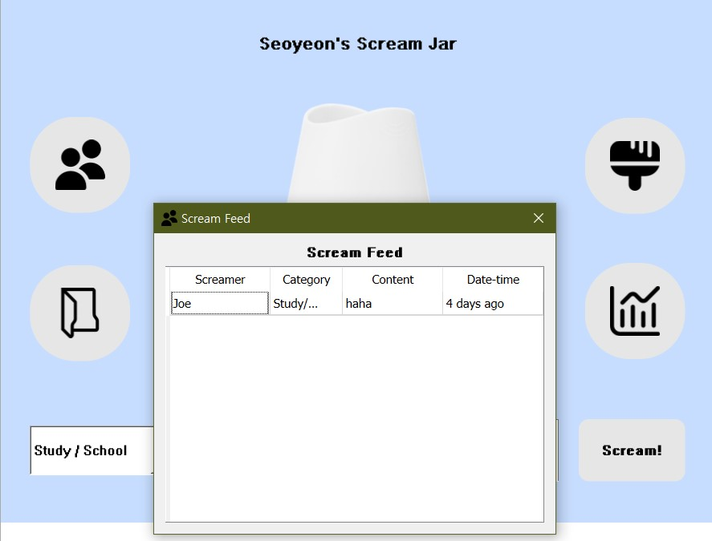
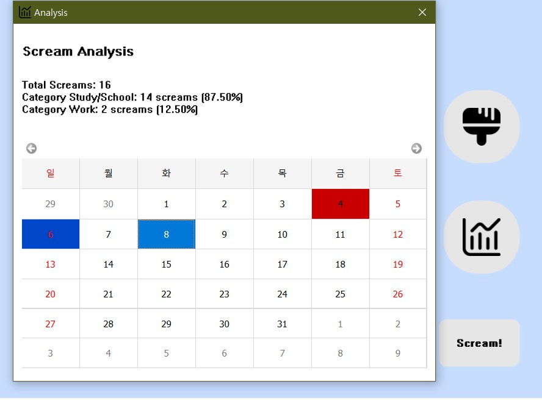
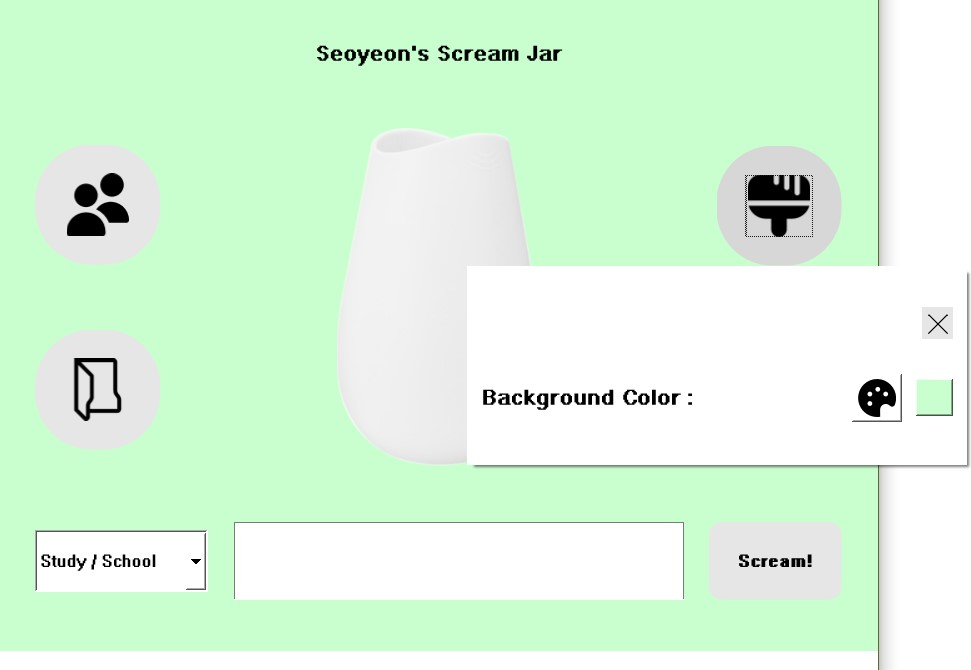

# 📢 Scream Jar

Scream Jar is a stress-relief desktop application where you can scream out your frustration, agony, and stress as much as you like. There is no need to hold it in, because here is a place sherely for letting it all out. Whether it be because of studies, work, relationship, or politics and society, just vent it to your scream jar. 

---

## ✨ Features

- 😤 Type your anger and stress and store it into the Scream Jar
- 🗓️ Calendar-based analysis – visualize scream frequency by color coding, track your stress sources by category (e.g. study, work)
- 🎨 Customizable Background color
- 🧑‍🤝‍🧑 Friend system with social feed – add friends and view their latest screams

---

## 💻 Tech Stack

| Component | Tech                      |
| --------- | ------------------------- |
| Frontend  | C++ with Qt (Widgets, UI) |
| Backend   | Python (Flask)            |
| Database  | Supabase (PostgreSQL)     |
| UI Design | Qt Designer (.ui files)   |

---

## 🚀 How to Run

Download the .zip file in Google Drive (link), unzip, and run the .exe file! Add a shortcut file to your desktop for better access.
Or : Open ```ScreamJar.pro``` in Qt Creator or build using `qmake && make` or `cmake && make` from terminal.

---

## 📸 Screenshots

<details>
<summary>1.	Sign up page</summary>
	
</details>

<details>
<summary>2.	Login page</summary>
	
</details>

<details>
<summary>3.	Main UI</summary>
	  
          
	  
	  
	  
	  
</details>

---

## 👩 Author
허서연 Seoyeon Heo | Seoul Natl. University, College of Liberal Studies, CSE major junior  
📫 Contact – best3487@snu.ac.kr
